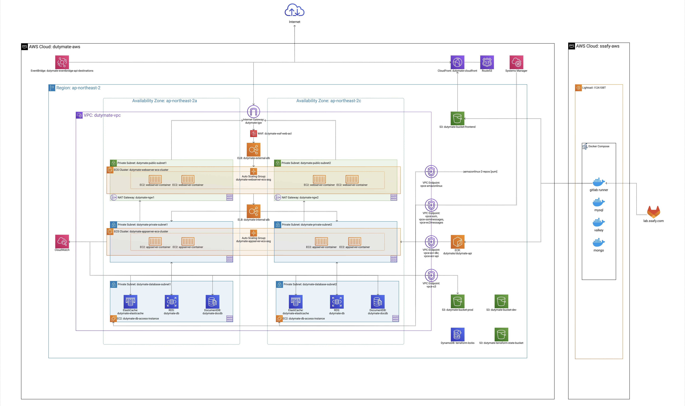

# 듀티메이트 (Dutymate) 

> **듀티표의 마침표를 찍다, 듀티메이트** - 공정하고 효율적인 듀티표 자동 생성, 실시간 소통, 개인 일정 반영으로 간호사들의 근무표 작성 고민을 해결하는 서비스

## 📋 목차

- [서비스 개요](#-서비스-개요)
- [문제 정의](#-문제-정의)
- [해결 방안](#-해결-방안)
- [주요 기능](#-주요-기능)
- [1차 배포 목표](#-1차-배포-목표-진행-중)
- [자율 프로젝트 로드맵](#-자율-프로젝트-로드맵)
- [기술 스택](#-기술-스택)
- [아키텍처 구성](#-아키텍처-구성)
- [브랜드 아이덴티티](#-브랜드-아이덴티티)
- [팀원 소개](#-팀원-소개)

## 📝 서비스 개요

**듀티메이트**는 병원 간호사들의 근무표(듀티표) 관리를 위한 올인원 솔루션입니다.

### 목표

듀티표 생성 자동화와 소통 과정 통일화를 통해 간호사들의 업무 만족도를 높입니다.

### 페르소나

**병동 간호사 '이수진' (29세)**

- **문제점**:
  - 공정하지 않은 듀티표, 개인 일정 미반영
  - 듀티표 제작/수정 과정이 복잡하고 불편함
- **니즈**:
  - 공정하고 개인 일정이 반영된 근무표 생성 자동화
  - 듀티표 제작 및 간호사 관리에 필요한 채널 통일화

## 🔍 문제 정의

### 1. 공정성과 효율성이 부족한 듀티표 수기 작성

- **약 85%의** 간호사들이 **수작업** 방식으로 듀티표 작성
- 개인 일정, 숙련도, 근무 규칙 등이 제대로 반영되지 않아 불만이 발생
- 규칙 위반 사항의 실시간 확인이 불가하여 **오류**와 **편향**이 발생
- **"모두를 만족시킬 수 없다"는** 전제로 **비효율성과 비공정성을 정당화**

### 2. 듀티표 생성/수정 과정에서 협업 및 소통의 어려움

- 종이, 엑셀, 카카오톡, 개인 캘린더 등 소통 채널이 **분산화됨**
- 근무표 변경 요청, 근무 조율 등의 과정에서 **실시간 소통과 확인이 어려움**

## 💡 해결 방안

### 자동화된 근무표 생성 및 관리

- 알고리즘을 활용한 최적의 근무표 자동 생성 (개인 요청, 병동 규칙, 연차 반영)
- 병동 관리자의 효율적인 근무표 수동 수정 및 규칙 설정 기능

### 통합적인 정보 관리와 소통

- 체계적인 **병동 관리 페이지로** 정보 관리 일원화
- 요청 근무 관리, 전담 근무 설정, 숙련도 등 간호사 데이터 관리

### 커뮤니티 기능으로 정보 공유 및 소속감 강화

- 자유게시판, QnA, 병원/이직 정보 등 익명 공유
- 연차별 인기 게시글 큐레이팅으로 사용자 참여 유도
- AI 기반 간호 뉴스 요약 기능으로 최신 간호 관련 정보 제공

## ✨ 주요 기능

### 근무표 관리

- **근무표 자동 생성**: 병동 규칙과 개인 요청을 반영한 알고리즘 기반 생성
- **수동 수정**: 간단한 키맵 입력으로 듀티 수정 및 히스토리 추적
- **통계 제공**: 근무표 완성도, 개인별/일별 통계 표시
- **달력 연동**: 월별 근무표와 OFF 일정 표시, 엑셀 및 이미지 다운로드

### 회원 관리

- **로그인/회원가입**: 일반 및 소셜 로그인, 부가정보 입력
- **마이페이지**: 회원 정보 수정, 프로필 이미지 변경, 닉네임 변경, 병동 탈퇴

### 병동 관리

- 병원/병동 정보 관리 및 간호사 정보 조회
- 간호사 추가/삭제, 요청 근무 관리, 병동 코드 생성/입장 관리

### 커뮤니티

- **자유게시판**: 연차별 인기 글 추천, HOT 게시판
- 댓글/대댓글 작성, 좋아요 기능, 사진 추가
- **간호 뉴스 AI 요약**: AI가 추천하는 TOP 5 간호 관련 뉴스를 자동으로 요약하여 제공(6시, 14시, 21시 자동 업데이트)

### 모바일 최적화

- 나의 근무표 및 동료 근무표 캘린더 뷰
- 요청 근무 작성 및 승인 여부 확인

## 🎯 1차 배포 목표 (진행 중)

1. **근무 유형 확장**

   - M(미드) 근무 추가 및 전담 근무 기능 구현

2. **데모 기능 개발**

   - 로그인/회원가입 없이 시스템 체험 가능한 데모 버전
   - 데모 종료 시간 타이머 및 기능 설명 가이드 추가

3. **비즈니스 모델 구현**

   - 결제 유도창 개발 및 코호트 분석
   - 자동생성 횟수 제한 및 충성 고객 관리

4. **보안 및 인증 강화**

   - 이메일 인증(회원가입, 로그인) 구현
   - 데이터베이스 암호화 적용

5. **UX 개선**

   - 근무 규칙 모달 중복 제시 이슈 해결

6. **사용자 관리 기능**
   - 문의 창구(채널톡) 기능 구현
   - 회원 탈퇴 기능 구현

## 🚀 자율 프로젝트 로드맵

자율 프로젝트 기간 동안 서비스의 안정성 향상과 사용자 요구사항 기반 신규 기능 개발을 진행하여 현실적인 병원 근무 환경에 최적화된 듀티메이트를 완성합니다.

### 우선순위: 상

1. **근무 유형 및 관리 기능 강화**

   - 커스텀 근무 유형(유형명, 색상, 시간, 키프레스) 추가
   - 요일별 근무인원 배정 차등화 (예: 월화수 데이 4명, 목금 데이 3명)
   - D/E 연속 근무 발생 문제 해결
   - D/OFF 다중 선택 요청 및 취소 기능
   - 근무 규칙 커스터마이징 및 알고리즘 반영

2. **사용자 경험 개선**

   - 근무표 생성 페이지 프론트엔드 리팩토링
   - 근무요청/내역 접근성 향상 및 월별 출력
   - 요청 내역 삭제 기능

3. **보안 및 인증 강화**

   - 간호사 면허 인증 기능 구현

4. **플랫폼 확장**
   - 하이브리드 앱 개발 (리액트 네이티브)

### 우선순위: 중

1. **사용자 관리 기능**
   - 듀티표/병동 관리 드래그 기능(근무 순번 변경)
   - 입사일 기준 연차 계산 기능
   - 공휴일 직접 설정 및 기피 근무 지정 기능
   - 랜딩페이지 고도화
   - 간호사 그룹 기능

## 🛠 기술 스택

### Frontend

- **Language**: TypeScript
- **Framework**: React 18
- **UI/스타일링**: TailwindCSS, Styled-components
- **상태 관리**: Zustand, React Query(TanStack Query)
- **라우팅**: React Router Dom
- **개발 도구**: Vite, Biome
- **유틸리티**: XLSX, html-to-image, react-toastify, Heroicons, Lottie

### Backend

- **Language**: Java 21
- **Framework**: Spring Boot 3.4
- **Database**: MySQL, MongoDB, Redis
- **ORM**: Spring Data JPA
- **인증/보안**: JWT, BCrypt
- **이메일 서비스**: Spring Mail
- **개발 도구**: Lombok, P6Spy, Checkstyle

### Infra

- **Containerization**: Docker
- **CI/CD**: GitLab CI
- **IaC**: Terraform
- **Cloud**: AWS ECS, ECR, RDS, ElastiCache, DocumentDB, DynamoDB, S3, CloudFront, Route53, CloudWatch, WAF, IAM, KMS
- **FinOps**: Infracost

## 📐 아키텍처 구성

## 🎨 브랜드 아이덴티티

### 로고

듀티메이트는 두 가지 로고 버전을 사용합니다:

  

    
<strong>텍스트 로고</strong>

    
  

  

    
<strong>아이콘 로고</strong>

    
  

## 👥 팀원 소개

|  |  |  |  |  |  |
|:----------------------------------------------------------------------------:|:------------------------------------------------------------------------:|:----------------------------------------------------------------------------:|:-----------------------------------------------------------------------------------------------:|:------------------------------------------------------------------------:|:-------------------------------------------------------------------------:|
|                                   이재현 (팀장)                                   |                                   김서현                                    |                                     김민성                                      |                                               김현진                                               |                                   임태호                                    |                                    한종우                                    |
|                                 PM, Frontend                                 |                                 Frontend                                 |                                   Backend                                    |                                             Backend                                             |                                 Backend                                  |                               Infra, Mobile                               |
|                [marunturtle](https://github.com/marunturtle)                 |                  [ksh0125](https://github.com/ksh0125)                   |                [minssungkim](https://github.com/minssungkim)                 |                             [hyun0zin](https://github.com/hyun0zin)                             |                  [taeho99](https://github.com/taeho99)                   |                  [jongwooo](https://github.com/jongwooo)                  |
