# 듀티메이트 활용 가이드

## Version 2.4.0 2025년 5월 21일

### **1. 데모 버전**

데모 페이지에서 서비스의 주요 기능을 경험해볼 수 있습니다. 사용시간은 10분입니다.

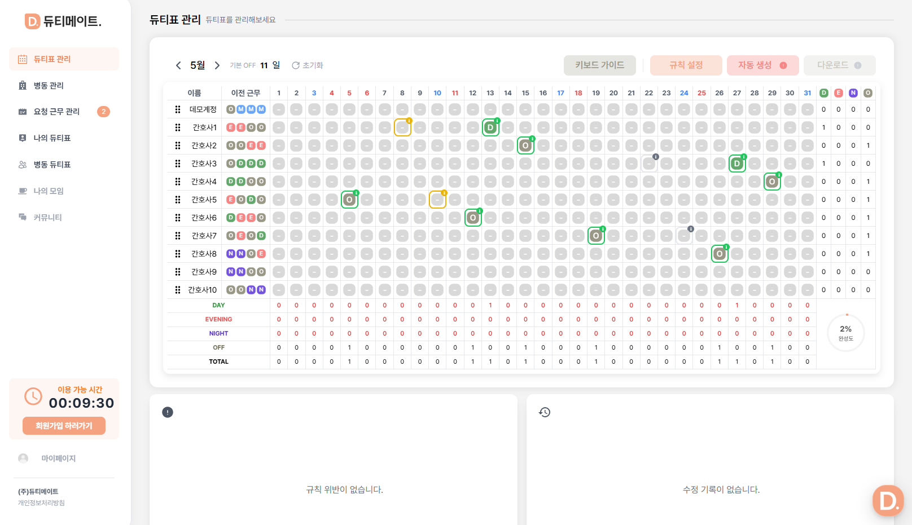

### **2. 이메일 인증**

이메일 인증이 필요한 계정은 이메일 인증을 요청합니다.

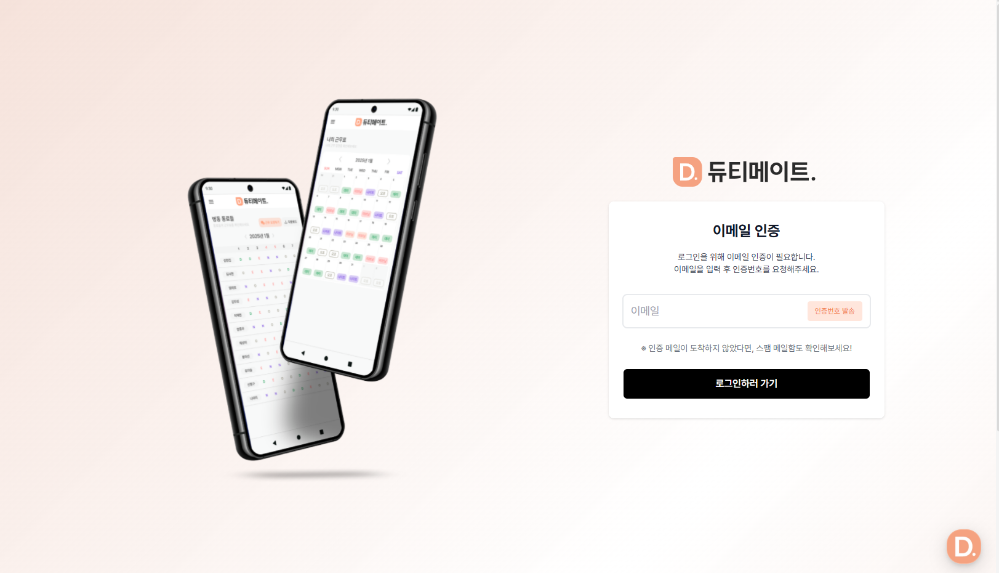

### **3. 대기 중인 요청 확인**

기능 추가: 자동 생성 클릭 시 대기 중인 요청이 있다면 승인/거절을 선택하도록 유도합니다.

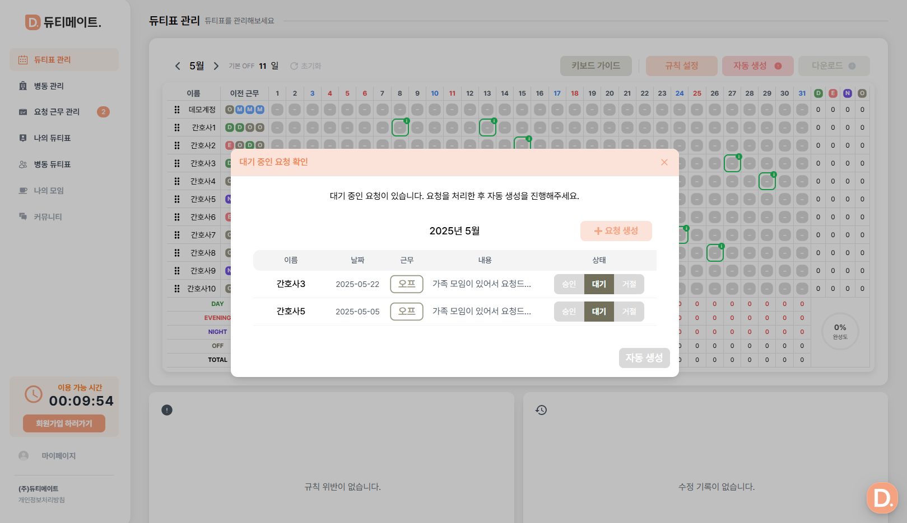
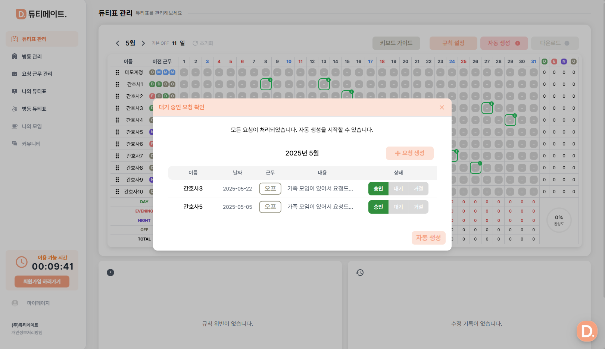

### **4. 자동생성 횟수 차감**

자동생성 횟수를 제한하고 있기 때문에 횟수가 차감됨을 명시

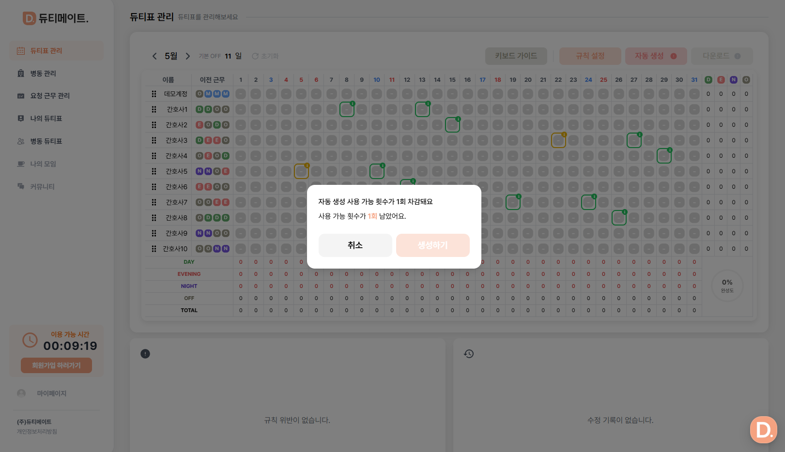

### **5. 간호사 부족 시 임시간호사를 추가할 수 있는 옵션 제공**

자동생성을 위한 간호사 인원이 부족할 경우 이를 미리 사용자에게 알리고 임시 간호사를 추가할 수 있도록 합니다.

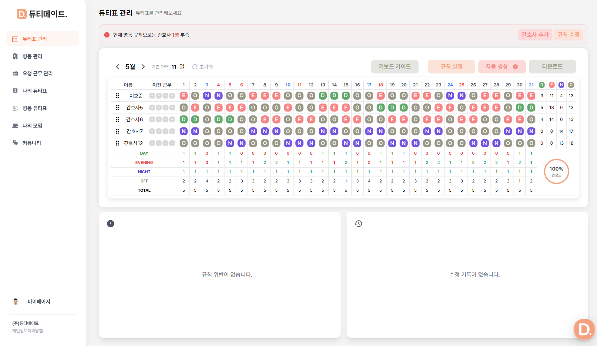
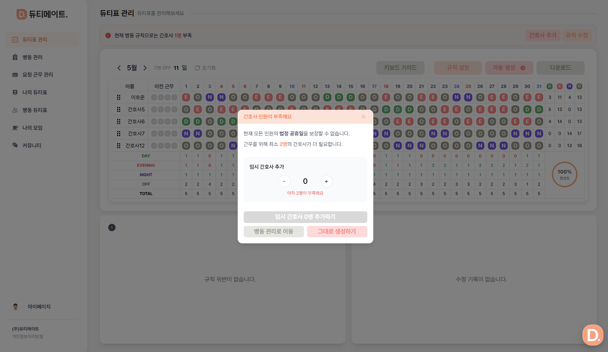
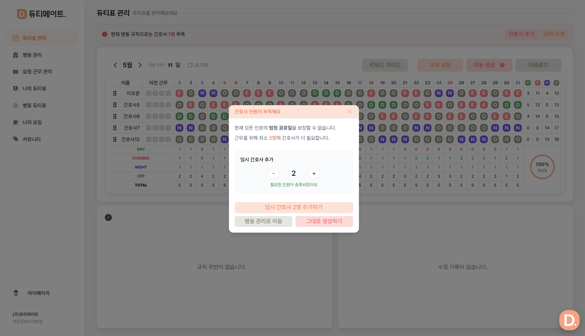
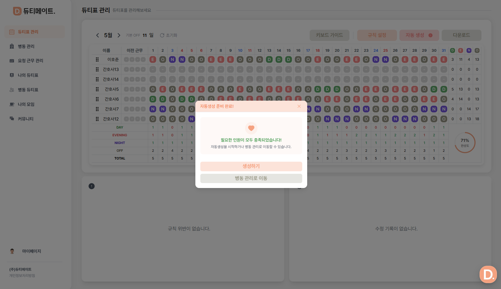

### **6. 나의 듀티표에서 내 일정을 추가합니다.**

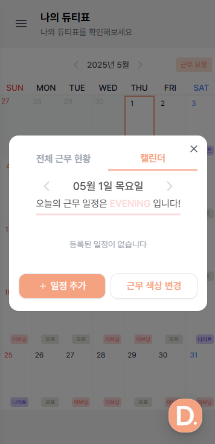
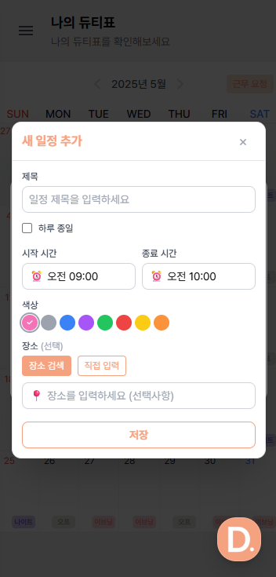

### **7. 근무 뱃지 색상을 커스텀 합니다.**

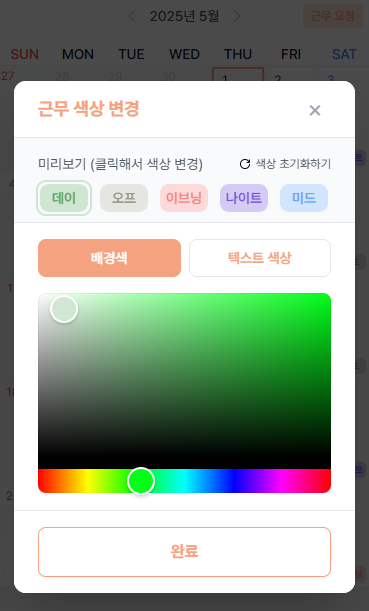

### **8. 나의 모임 기능**

나의 모임을 생성하여 친구들을 초대하여 근무표를 공유유합니다.

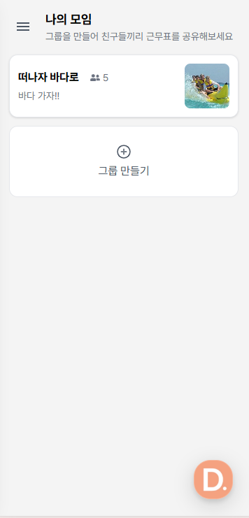
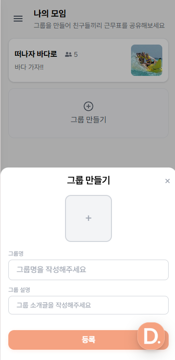
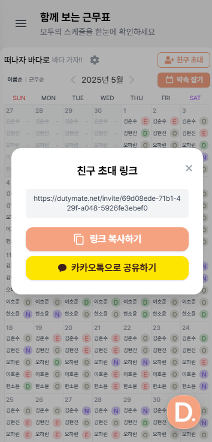

### **9. 약속 날짜 추천 기능**

나의 모임 내에서 친구들과 함께 약속 가능한 날짜를 추천 받습니다.

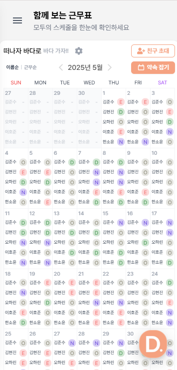
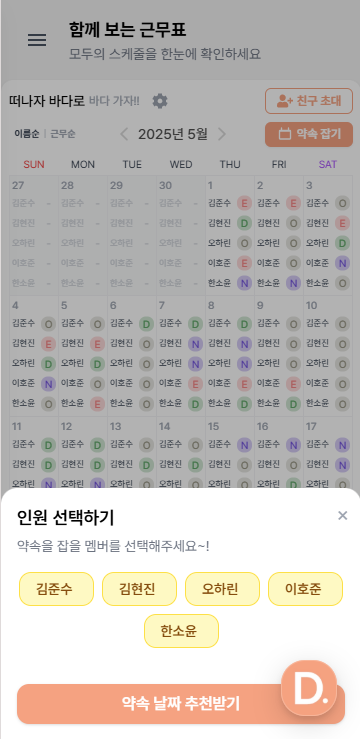
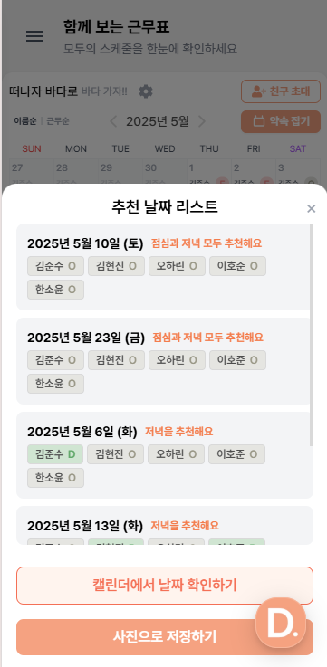
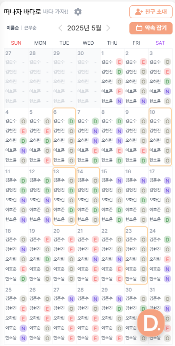

## Version 1.0.0 2025년 2월 20일

### **1. 랜딩페이지**

서비스 맛보기를 통해 데모를 진행하거나 시작하기를 통해 로그인/회원가입을 진행합니다.

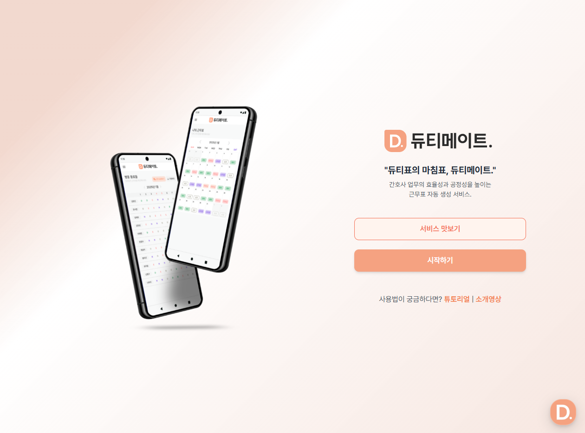

### **2. 로그인하기**

이메일 로그인 및 소셜 로그인이 가능합니다.

### **3. 부가정보 입력하기**

부가정보 입력 페이지에서 간호사 연차, 성별, 직책을 선택합니다.

### 4. 병동 생성하기 (수간호사)

수간호사는 병원명과 병동명을 입력하여 병동을 생성합니다.

- 병원명 입력하여 병원명을 검색할 수 있습니다.

### 5. 듀티표 관리 (수간호사)

**5-1. 자동 생성 기능 체험하기**

최적의 듀티표를 찾는 알고리즘을 통해 다양한 규칙이 반영된 듀티표가 자동 생성됩니다.

- `자동 생성💡` 버튼에 마우스를 올리면, 근무표가 생성되는 규칙을 확인해 볼 수 있습니다.

- `자동 생성💡` 버튼 클릭 시, 자동생성 시 적용되는 규칙을 확인할 수 있습니다.
- 규칙 수정하기를 통해 원하는 규칙으로 수정이 가능합니다.

**5-2. 자동 생성된 스케줄 확인하기**

근무 요청이 반영된 자동 생성된 스케줄을 확인하여 정상적으로 배정되었는지 점검합니다.

퍼센트(%)로 완성도를 확인할 수 있습니다.

- 요청 근무 확인하기
  - 초록색 : 승인된 요청 근무
  - 노란색 : 대기 중인 요청 근무
  - 검은색 : 거절된 요청 근무

**5-3. 듀티표 수동으로 수정하기**

**듀티표를 수동으로 수정**하면서 원하는 듀티표를 작성할 수 있습니다.

키보드 D, E, N, O를 통해 직접 듀티표 수정이 가능합니다.

- 규칙이 적용되지 않았다면, **이슈를 통해 확인**할 수 있습니다.
- **돌아가기 버튼**을 눌러 이전 수정 사항으로 돌아갈 수 있습니다.

### 6. 병동 관리 (수간호사)

병동 내 간호사 정보를 확인할 수 있습니다.

- 간호사들의 이름, 직위, 성별, 경력을 확인할 수 있습니다.
- 관리자는 간호사의 숙련도, 전담 근무, 메모를 작성할 수 있습니다.
- 병동 내 간호사에게 관리자 권한을 넘길 수 있고, 병동 내보내기가 가능합니다.

**6-1. 임시간호사 추가하기**

**임시간호사 추가하기** 기능을 통해 병동 내 간호사가 입장하기 전, 듀티메이트 자동생성 기능을 사용해볼 수 있습니다.

**6-2. 병동 코드 복사하기**

병동 관리 페이지에서 생성된 **병동코드**를 동료들에게 공유합니다.

- 복사하기 버튼을 누르면 병동 코드가 복사됩니다.

**6-3. 입장 내역 조회하기**

**입장 대기 중인 동료들을 승인**하여 같은 병동에서 근무를 관리할 수 있도록 합니다.

- 내 동료가 맞는지 확인하고 수락 또는 거절합니다.

- 기존에 추가한 **임시 간호사와 연동**할 수 있으며, **연동하지 않고 추가**할 수 있습니다.

### 7. 요청 근무 관리

평간호사들이 보낸 요청 근무를 승인 또는 거절 할 수 있습니다.

- 승인 또는 거절한 요청은 듀티표에서 잘 반영이 되었는지 확인할 수 있습니다. [(요청 근무 반영 확인하기)](https://www.notion.so/1a0e783c8bfc8009b3f5d5e7157e0bf7?pvs=21)

### 8. 병동 입장하기 (평간호사)

평간호사로 부가정보를 기입한 간호사는 병동에 입장할 수 있습니다.

- 전달 받은 코드를 입력하여 병동에 입장할 수 있습니다.

### 9. 나의 듀티표 보기

`나의 듀티표` 페이지에서 수간호사가 작성한 듀티표를 월별로 확인할 수 있습니다.

- 특정 날짜를 선택하면, 해당 날짜에 함께 근무하는 동료들의 근무를 확인할 수 있습니다.
  

### 10. 동료 듀티표 보기

병동 듀티표 보기를 통해 이번달 동료들의 듀티를 한 번에 확인 할 수 있습니다.

신청한 요청 근무는 수간호사가 요청 근무 관리 페이지에서 확인할 수 있습니다. [(요청 근무 관리)](https://www.notion.so/1a0e783c8bfc8009b3f5d5e7157e0bf7?pvs=21)

- 원하는 근무를 **근무 요청 기능**을 통해 신청할 수 있습니다.

- 내가 신청한 요청 내역을 확인할 수 있습니다. (승인 / 대기 / 거절 상태 확인 가능)
  

### 11. 커뮤니티

커뮤니티에서 일상글 / 간호지식 Q&A / 이직 정보에 대해 **익명으로 자유롭게 소통**할 수 있습니다.

- **큐레이팅 모델**을 통해 간호사별 연차 / 좋아요수 / 조회수 / 내용을 바탕으로 추천 게시글을 띄워줍니다.
- 네이버 뉴스를 GPT가 선별하여 **오늘의 간호 뉴스**를 제공합니다.

### 12. 마이페이지

마이페이지에서 기본적인 **프로필 정보를 수정**할 수 있으며, **비밀번호 변경**을 진행할 수 있습니다.

- 마이페이지에서 로그아웃 / 병동 나가기 / 회원 탈퇴하기가 가능합니다.

