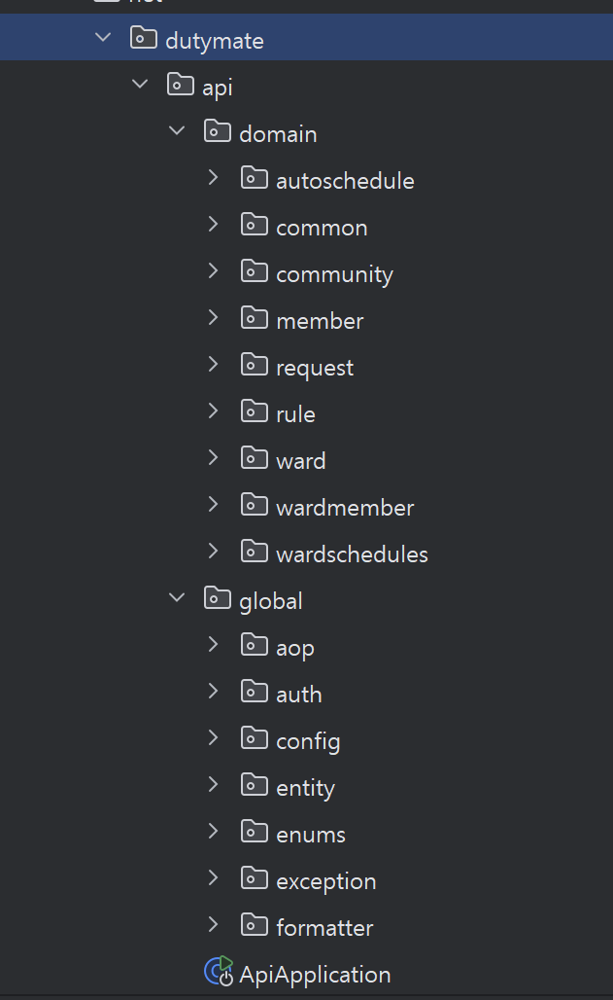

# TIL

## 1. global.css 파일과 react component 구조

- mid 버튼을 추가하며, dutymate 프로젝트의 react 구조를 파악하였고, global.css 파일로 전역의 색상을 관리하는 방식을 배웠다. 해당 과정에서 새로운 근무 유형을 성공적으로 추가할 수 있었다.

## 2. 폴더 구조 refactoring 

- 기존 서비스의 폴더구조가 직관적이지 않았고, 폴더 구조를 refactoring 하여 직관적인 구조로 바꾸었다. 해당 과정에서 다양한 참조할만한 다양한 jpa 프로젝트들을 보며, 폴더 구조에 대한 직관을 얻고 dutymate 에 이식할 수 있었다.

refactor 전.
.png>)

refactor 후.

