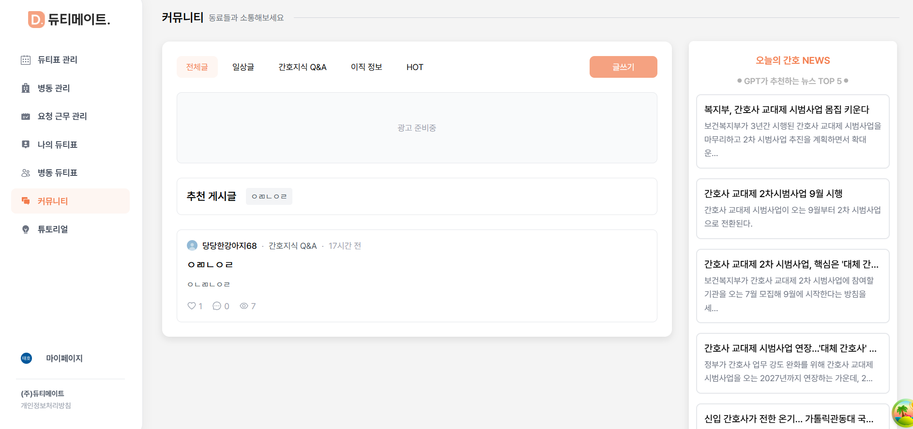

# Today I Learned

> 2025년 04월 24일 임태호

## 1. 커뮤니티에 광고 배너 영역 추가
- 광고 배너 위치에 대한 고믾이 많았다.
- 검색해 본 결과, 사용자들이 자주 눈이 가는 곳은 왼쪽, 그리고 상단이다.
- 왼쪽은 사이드바가 위치해 있기 때문에 커뮤니티 상단에 배치하기로 했다.
- 추후 구글 애드센스를 신청하여 실제 광고를 삽입할 예정이다.
- 다른 페이지에도 광고 배너를 삽입할 만한 위치가 있는지 팀원들과 추후 논의가 더 필요하다.



## 2. 데모 계정 일괄 삭제 API에 보안 옵션 추가

### 문제 상황
- 기존 데모 계정 일괄 삭제 API는 Github actions에 의해 30분 주기로 호출된다.
- 그러나 이 API는 리소스가 크고 **악의적인 사용자가 API 경로를 알아내 반복적을 호출**한다면, 서버에 큰 부담을 줄 수 있다는 문제가 있다.

### 해결 방안
- 비밀키를 HTTP 요청의 커스텀 헤더에 넣어 서버에서 비밀키가 일치한지 확인한다.
- 일치하지 않는다면, 비즈니스 로직은 실행되지 않게 막아놨다.

```java
@DeleteMapping("/demo")
public ResponseEntity<?> deleteDemoMember(@RequestHeader(value = "X-API-KEY", required = false) String apiKey) {
    if (apiKey == null || !apiKey.equals(apiDemoSecret)) {
        throw new ResponseStatusException(HttpStatus.UNAUTHORIZED, "Invalid API Key");
    }
    memberService.deleteDemoMember();
    return ResponseEntity.ok().build();
}
```

## 3. 데모 병동에는 병동 코드가 응답으로 반환되지 않도록 핫픽스

### 문제 상황
- 데모 병동에는 실제 사용자가 절대 입장해서는 안된다.
- 만약 실제 사용자가 입장한다면, 데모 계정이 삭제될 때 병동에 입장한 **실제 사용자**가 탈퇴 처리된다.
- **실제 사용자**는 나도 모르는 사이에 회원 탈퇴가 되는 셈

### 해결 방안
- 데모 계정은 병동 코드가 응답으로 반환되지 않도록 개선하였다.
- 서비스 로직에서 데모 계정인지 판단하고, 데모 계정이면 DTO에 병동 코드를 빈 문자열로 설정하였다.

```java
// 데모계정인 경우 -> 병동 코드를 빈 문자열로 삽입
WardInfoResponseDto wardInfoResponseDto = WardInfoResponseDto.of(ward, wardMemberList, enterWaitingCnt);
if (member.getEmail().endsWith(MemberService.DEMO_EMAIL_SUFFIX)) {
    wardInfoResponseDto.setWardCode("");
}
return wardInfoResponseDto;
```
