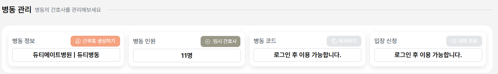

# Today I Learned

> 2025년 04월 29일 임태호

## 1. 데모 이메일로 회원가입/로그인 막기

## 문제 상황
- 기존에는 마음만 먹으면 데모 계정으로 회원가입도 할 수 있고 로그인도 할 수 있었다.
- 그러나 데모 계정은 주기적으로 삭제되기 때문에 데모 이메일로 회원가입 하는 경우를 막아야만 했다.

## 해결 방안
- 회원가입, 로그인, 이메일 인증 로직에 유효성 검증 로직을 추가하여 막을 수 있었다.

```java
// 이메일이 @dutymate.demo로 끝나는지 확인
if (loginRequestDto.getEmail().toLowerCase().endsWith("@dutymate.demo")) {
    throw new ResponseStatusException(HttpStatus.BAD_REQUEST, "아이디 또는 비밀번호 오류입니다.");
}
```

## 2. 임시 간호사를 병동에서 내보낼 때, 탈퇴 처리도 시키기

### 문제 상황
- 현재 임시 간호사를 생성할 때 `MEMBER` 테이블에 임시 간호사가 INSERT 된다.
- 임시 간호사를 병동에서 내보낸다면, 아무 쓸모가 없는 상태가 되는데 `MEMBER` 테이블에서 DELETE되지 않았다.
- 결국, **아무 역할도 하지 않는 임시 간호사가 `MEMBER`테이블에서 계속 쌓이고 있다.** 

### 해결 방안
- 병동에서 내보내기 로직에 내보내는 사용자가 **임시 간호사일 경우, 탈퇴 처리**한다.


```java
// 임시 간호사이면 탈퇴 처리
if (member.getEmail().equals(MemberService.TEMP_NURSE_EMAIL)) {
    memberRepository.delete(member);
}
```

## 3. 임시 간호사만 있을 때, 병동 나가기 가능하게 수정

### 문제 상황
- 병동에 나를 제외하고 **임시 간호사만 있으면, 병동 나가기가 가능**해야 한다.
- 병동 권한을 넘기고 병동을 나갈 수 있다. 그러나 임시 간호사에겐 병동 권한을 넘길 수가 없다.

### 해결 방안
- 병동에 임시 간호사만 있으면, 임시 간호사를 삭제하고 병동 나가기가 가능하도록 수정해야 한다.

```java
// 임시 간호사 탈퇴 로직
for (WardMember wm : wardMemberList) {
    if (member != wm.getMember()) {
        memberRepository.delete(wm.getMember());
    }
}
// 몽고DB 삭제
wardScheduleRepository.deleteByWardId(ward.getWardId());
// RDB 삭제
wardRepository.delete(ward);
```

## 4. 데모 버전에서 병동 코드 복사와 입장 신청 버튼 비활성화 처리

- 데모 버전에서는 병동 코드를 이용한 병동 입장 신청을 막아야 한다.
- 백엔드 로직은 막았으나 프론트에서 한 번 더 막아야 해서 수정했다.


