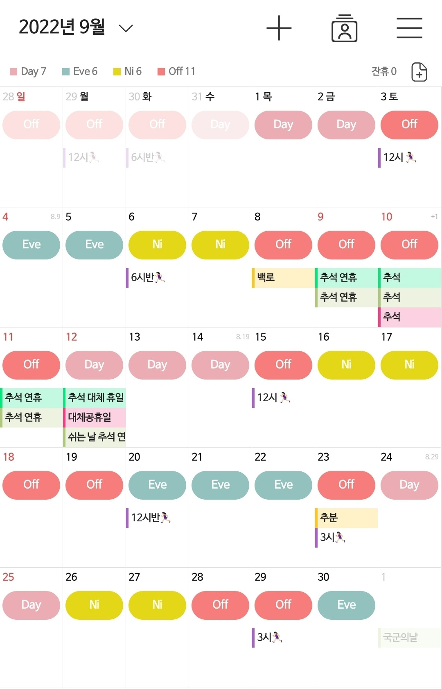

# Today I Learned

> 2025년 04월 30일 임태호

## 1. 듀티메이트 VER.2 새로운 기능 요구사항 명세서 작성

### 추가할 기능
- **나의 듀티표**
    -  탭 (병동 캘린더, 나의 캘린더-여기서 커스텀 가능, 불러오기 기능)
    - 컬러 커스텀
    - 수동으로 듀티 넣기
    - 네이티브 캘린더와 연동
    - 나의 달력에 병동 근무표 불러오기 (동기화 기능)
    - 음력 날짜 추가(생신, 가족행사-제삿날)
    - 커스텀 근무 유형(교육, 휴가, 데브닝 등) → 컬러 커스텀 가능
        - 친구 그룹 기능때문에 시간도 커스텀 필요
    - 캘린더 추가 기능
        - 레퍼런스 사진
        - 

- **친구 그룹 만들기**
    - 친구들과 최적의 약속 날짜 잡기
    - 친구 근무표 한 눈에 확인하기
    - 그룹 내에서도 약속 인원 선택 기능
    - 가중치로 최적의 약속 날짜 점수로 보여주는 기능
    - 그룹장 넘기기 , 내보내기 기능(그룹 맴버 설정 탭), 인원 추가하기 , 임시 간호사?
    - 게시판 없음 , 게시판보다 각자 근무표 메인에 뜨게
    - 근무표 공개/비공개 선택할 수 있게 하기
    - 그룹 나가기
    - 그룹 초대하기 (카톡 비즈니스 채널)
        - 설치 하세요 페이지

- **공지사항 게시판**
- **근무 통계 리포트 (금액)**
- **스티커 이모티콘**
    - 캘린더 꾸미기용
    - 오프주세요 이모티콘
- **비밀번호 찾기**
- 평간호사도 코드 입력 없이 입장 가능하게 수정하기

## 2. 마케팅·홍보 전략 탐색

### 홍보 채널 탐색 및 홍보 게시글 작성
- 네이버 카페 -> **진행 중**
- 네이버 블로그
- 오픈 카톡 -> **진행 중**
- 다음 카페
- 간호사 지인
- 4학년 간호학과 학생
- 블라인드
- 디시인사이드
- 널스스토리
- 메디잡