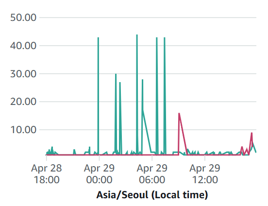

# Today I Learned

> 2025년 04월 29일

## 오늘의 장애 부검

프로덕션 환경에서 다음과 같은 로그를 확인했다.

```shell
2025-04-29T06:51:45.787+09:00  WARN 1 --- [nio-8080-exec-3] o.s.b.actuate.mail.MailHealthIndicator   : Mail health check failed
jakarta.mail.AuthenticationFailedException: 454-4.7.0 Too many login attempts, please try again later. For more information,
```

서비스에서는 이메일 인증을 위해 메일을 발송하는 기능이 있다.
이 기능을 사용하기 위해서는 SMTP 서버에 로그인해야 하는데, 로그인 시도 횟수가 너무 많아져서 SMTP 서버에서 차단된 것이다.
이 때문에 서버가 계속 재시작되고 있었다.

### 장애 원인

장애 원인은 SMTP 서버에서 로그인 시도 횟수가 너무 많아져서 차단된 것이다.
그러면 로그인 시도 횟수는 어떻게 늘어난 것일까?

WAF에서 차단된 IP를 확인해보니, 특정 IP에서 로그인 시도가 너무 많았다.



현재 회원가입 페이지에서는 이메일 인증 버튼이 있는데, 인증 발송 후 발송 버튼이 비활성화되지 않고 있다.
이 때문에 사용자가 계속해서 인증 버튼을 클릭할 수 있었다.
이로 인해 악성 사용자가 인증 버튼을 클릭하여 로그인 시도 횟수가 너무 많아져서 차단된 것이다.

### 장애 해결

이를 해결하기 위해 인증 버튼을 클릭했을 때, 인증 버튼을 비활성화하도록 수정했다.
